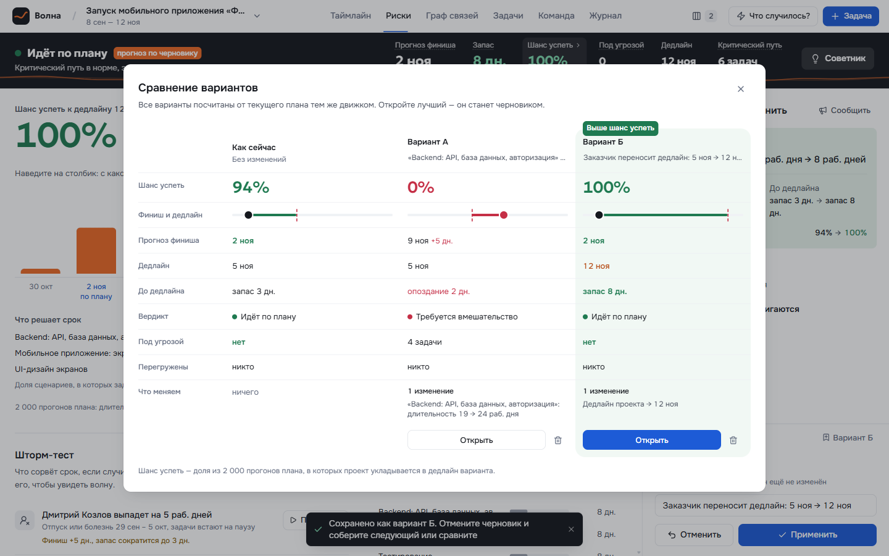

# Волна — что будет с проектом, если сейчас что-то изменится

Веб-приложение для руководителя проекта. Хакатон, кейс 1 «Проект начинает срываться» (ТЗ — [`docs/tz.pdf`](docs/tz.pdf)).

Руководитель ведёт план: задачи, длительности, зависимости, ответственных. Любую правку — «бэкенд займёт на 5 дней
больше», «дизайнер уходит в отпуск», «заказчик сдвигает дедлайн» — «Волна» сначала показывает как черновик:
какие задачи сдвинутся и по какой цепочке, что станет с финишем и дедлайном, как изменится вероятность успеть,
кого из команды это касается. Решение применяется одной кнопкой и попадает в журнал с возможностью отката.



## Живая версия

**https://volna.onrender.com** — ничего устанавливать не нужно.

Демо-проект «ФитТрек» общий для всех посетителей: удалить его нельзя, а после изменений он сам возвращается
в исходное состояние (через час без правок и каждый новый день). Собственные проекты можно создавать свободно.
Сайт на бесплатном тарифе: если он долго простаивал, первое открытие может занять до минуты.

## Быстрый старт

### Вариант 1. Docker (рекомендуем)

Нужен только [Docker Desktop](https://www.docker.com/products/docker-desktop/) (Windows, macOS на Intel и Apple Silicon, Linux).

```bash
git clone https://github.com/bodhiswaga/Hackathon-Volna.git
cd Hackathon-Volna
docker compose up --build
```

Откройте **http://localhost:3001**. Первая сборка занимает 1–3 минуты. Демо-проект создаётся автоматически.

Остановить — `Ctrl+C`, затем `docker compose down`. Стереть данные и начать с чистого демо — `docker compose down -v`.

Без compose:

```bash
docker build -t volna .
docker run --rm -p 3001:3001 -v volna-data:/data volna
```

### Вариант 2. Node.js

Нужны **Node.js 22.13 или новее** (проверено на 24 и 25) и npm 10+. База данных встроена в Node (`node:sqlite`),
ставить её отдельно не нужно; нативной сборки модулей тоже нет.

```bash
git clone https://github.com/bodhiswaga/Hackathon-Volna.git
cd Hackathon-Volna
npm ci
npm start
```

`npm start` собирает фронтенд и поднимает всё на **http://localhost:3001**.

Режим разработки с горячей перезагрузкой: `npm run dev` → http://localhost:5173 (API на :3001, Vite проксирует `/api`).

## Как посмотреть главное за 5 минут

1. Откройте демо-проект «Запуск мобильного приложения „ФитТрек“».
2. Нажмите на название проекта вверху слева → **«Сбросить демо»**. Даты демо считаются от сегодняшнего дня,
   сброс даёт одну и ту же исходную картину: часть задач выполнена, часть в работе, запас до дедлайна 3 рабочих дня.
3. Пройдите сценарий из [`docs/demo-script.md`](docs/demo-script.md):
   - **«Шанс успеть»** в верхней полосе → вкладка **«Риски»**: вероятность уложиться в дедлайн, что решает срок, шторм-тест;
   - **«Что случилось?» → «Задача оказалась сложнее»** → Backend, +5 дней → волна сдвигов на таймлайне, прогноз по черновику;
   - **«Советник»** или **«Как вернуть сроки»** → варианты решения, каждый уже просчитан;
   - сохраните два черновика **«В варианты»** и сравните их кнопкой **«Варианты»** вверху;
   - **«Сообщить»** → готовое письмо заказчику и сообщения затронутым людям;
   - **«Применить»** → вкладка **«Журнал»** → откат к любому прошлому состоянию.

## Что умеет

| Возможность | Где в интерфейсе |
|---|---|
| План: задачи, длительности, зависимости (с паузой или нахлёстом), ответственные, сроки задач | «Таймлайн», «Граф связей», «Задачи», редактор задачи справа |
| Критический путь, резерв каждой задачи, перегрузка людей | Таймлайн (красные рамки, пунктир резерва), «На что обратить внимание» |
| What-if: любая правка сначала черновик, видна волна сдвигов, прежние даты и причина каждого сдвига | Оранжевые полосы, панель черновика внизу справа, «Подробнее» |
| «Что случилось?»: отпуск, задача сложнее, задержка подрядчика, новое требование, перенос дедлайна | Кнопка вверху |
| «Шанс успеть»: 2000 прогонов плана с разбросом оценок (Монте-Карло) | Верхняя полоса, вкладка «Риски» |
| Шторм-тест: какие сбои сорвут дедлайн, запас прочности каждой задачи | Вкладка «Риски» |
| Советник: ускорение, нахлёст, переназначение, перенос дедлайна; план восстановления | Кнопка «Советник» |
| Сравнение до четырёх вариантов решения | «В варианты» → «Варианты» |
| Письмо заказчику и сообщения команде, копирование, почта, печать в PDF | «Сообщить» |
| Журнал изменений с причиной и откатом | Вкладка «Журнал» |

Интерфейс адаптирован до ширины 375 px, доступен с клавиатуры, учитывает `prefers-reduced-motion`.

## Команды

| Команда | Что делает |
|---|---|
| `npm start` | Собрать фронтенд и запустить приложение на http://localhost:3001 |
| `npm run dev` | Режим разработки: web на :5173, API на :3001 |
| `npm test` | Тесты движка расчёта (vitest, 30 тестов) |
| `npm run typecheck` | Проверка типов во всех пакетах |
| `npm run build` | Только сборка фронтенда |
| `npm run seed` | Пересоздать демо-проект (то же, что «Сбросить демо» в интерфейсе) |
| `npm run e2e` | Сквозная проверка сценариев ТЗ через API (44 проверки). Нужен запущенный сервер, пересоздаёт демо |

## Настройки

| Переменная | По умолчанию | Назначение |
|---|---|---|
| `PORT` | `3001` | Порт сервера |
| `DB_PATH` | `apps/server/data/volna.db` (в Docker — `/data/volna.db`) | Файл базы SQLite |

Ключей API, внешних сервисов и авторизации приложению не нужно — `.env` не требуется.

## Деплой

Бесплатно на [Render](https://render.com): войти через GitHub → **New → Blueprint** → выбрать этот репозиторий.
Render прочитает [`render.yaml`](render.yaml) и соберёт образ из `Dockerfile` (5–8 минут). Каждый push в `main`
выкатывается автоматически. Бесплатный сервис засыпает после 15 минут без запросов — чтобы он отвечал сразу,
настройте бесплатный пингер (cron-job.org, UptimeRobot) на `GET /api/health` каждые 10 минут.

Диск бесплатного тарифа не сохраняется между перезапусками: база создаётся заново вместе с демо-проектом.
Для постоянного хранения подключите диск и укажите `DB_PATH` на него (или запустите образ на любом сервере с томом `/data`).

В образе: `NODE_ENV=production`, часовой пояс `Europe/Moscow` (от него считается «сегодня»), процесс не от root.
Сервер отдаёт собранный фронтенд с долгим кэшем для файлов с хэшем, `index.html` — без кэша.

## Если что-то не запускается

- **Порт 3001 занят.** Сервер пишет об этом и подсказывает команду. Запустите на другом порте:
  `PORT=3002 npm start` (Windows cmd: `set PORT=3002 && npm start`, PowerShell: `$env:PORT=3002; npm start`).
  В Docker поменяйте левую часть: `-p 3002:3001` или `ports: ['3002:3001']` в `docker-compose.yml`.
- **`npm start` и `npm run dev` одновременно** не запускайте: оба используют порт 3001.
- **`Cannot find module 'node:sqlite'` или ошибка про SQLite.** Слишком старый Node. Нужен 22.13+, проверьте `node -v`.
- **Docker: `Cannot connect to the Docker daemon`.** Запустите Docker Desktop и дождитесь статуса «Running».
- **Цифры отличаются от `docs/demo-script.md`.** Прогноз зависит от сегодняшней даты. Сбросьте демо в меню проекта.

## Как устроено

```
packages/engine   движок расчёта: чистый TypeScript без зависимостей, общий для клиента и сервера
apps/server       Fastify 5 + zod + node:sqlite: REST API, журнал изменений, раздача собранного фронтенда
apps/web          React 19 + Vite + Tailwind v4, TanStack Query, Zustand; собственный SVG-таймлайн, граф на React Flow
docs              ТЗ, сценарий демонстрации, скриншоты
```

- **Расчёт** — метод критического пути (прямой и обратный проход по рабочим дням), флаги риска, алерты, здоровье проекта.
- **What-if** работает на клиенте мгновенно: черновик — список операций, движок применяет их к плану и сравнивает с исходным.
  При «Применить» сервер повторяет расчёт тем же движком и атомарно пишет запись журнала со снимком «до» для отката.
- **Прогноз** — Монте-Карло поверх того же расчёта с детерминированным генератором: одинаковые входные данные дают одинаковые цифры.
- В базе хранятся только исходные данные; сроки, резервы и риски всегда пересчитываются.

Подробная документация по модели данных, алгоритмам, API и соглашениям — в [`CLAUDE.md`](CLAUDE.md).

## Допущения

Рабочие дни пн–пт без праздников · связи только «окончание → начало» · даты задач выводятся из длительности и связей
(мышью на таймлайне не перетаскиваются) · нет выравнивания ресурсов: перегрузка подсвечивается, но даты не двигает ·
нет авторизации — приложение рассчитано на одного руководителя.

---

Проект сделан одним разработчиком вместе с Claude (Anthropic).
